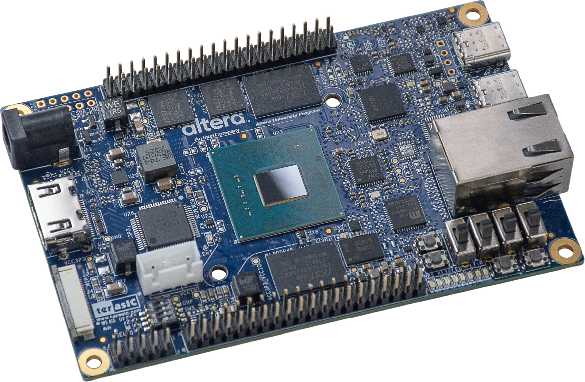

# Altera-DE25-Nano

A repository of project examples using the Altera DE25 Nano development board

Resouce links:
- Altera Quartus Prime Pro Edition v26.1: https://www.altera.com/downloads/fpga-development-tools/quartus-prime-pro-edition-design-software-version-26-1-windows 
- Terasic DE25-Nano Development and Education Board: https://www.terasic.com.tw/cgi-bin/page/archive.pl?Language=English&CategoryNo=115&No=1384 
- 

